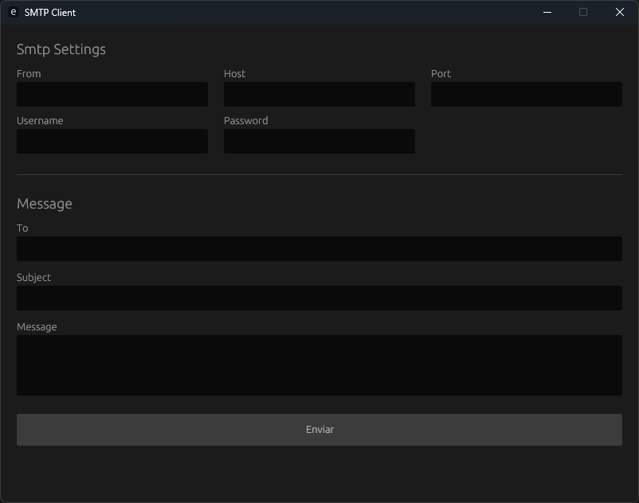

# SMTP-GUI

Smtp-Gui is a cross-platform graphical user interface mailer, for easy email sending/testing. It uses [lettre](https://github.com/lettre/lettre) mailer library and [egui](https://github.com/emilk/egui) GUI library.

## Building

This app uses native-tls, so be sure to have the system dependencies for ssl/tls. On windows is also necessary to have Visual Studio Build Tools.

